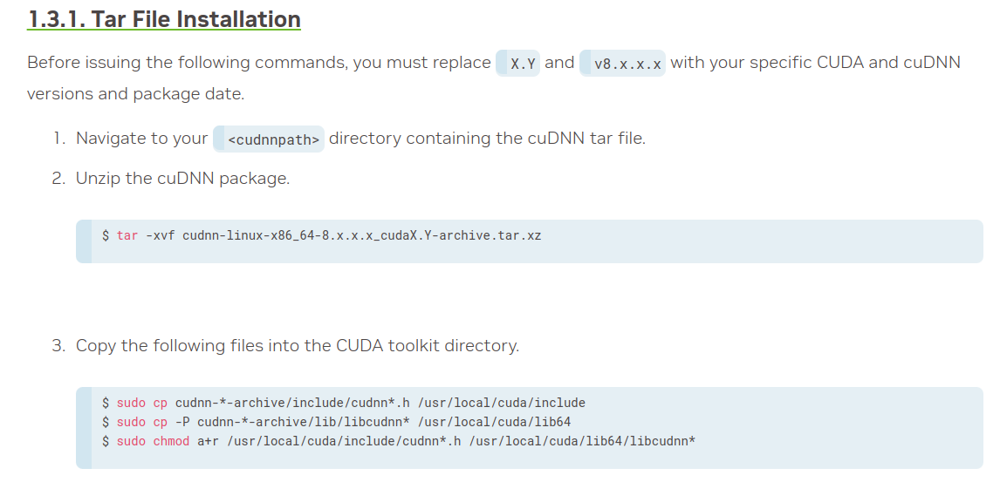

# Install-Opencv-4.7-CUDA-Ubuntu
Simple guide for installing opencv 4.7.0  on Ubuntu with Cuda and cuDNN. \
(To install opencv with cuda on NVIDIA Jetson Nano, skip to the end of this guide)\
\
There are 4 main components of installing opencv with Cuda on Ubuntu. 

- [Install-Opencv-4.7-CUDA-Ubuntu](#install-opencv-47-cuda-ubuntu)
  - [1. Install cuda.](#1-install-cuda)
  - [2. Install cuDNN.](#2-install-cuDNN)
      - [\*\*\*The following installation steps are for network installation:](#the-following-installation-steps-are-for-network-installation)
      - [\*\*\*From now on, the following installation steps are for tar file installation:](#from-now-on-the-following-installation-steps-are-for-tar-file-installation)
  - [3. Install the related nvidia driver.](#3-install-the-related-nvidia-driver)
  - [4. Build Opencv from source with Cuda and cuDNN enabled.](#4-build-opencv-from-source-with-cuda-and-cuDNN-enabled)
    - [jetson nano:](#jetson-nano)


## 1. Install CUDA

Open the [CUDA download link.](https://developer.nvidia.com/cuda-downloads?target_os=Linux&target_arch=x86_64&Distribution=Ubuntu&target_version=20.04&target_type=deb_network)
\
\
\
In this example, the related NVIDIA driver version is 535 which is present in the file named:\
"cuda-repo-ubuntu2004-12-2-local_12.2.0-**535**.54.03-1_amd64.deb"\
We will need to install this driver version which will be shown in the next steps.
\
\
After performing the operations above, you will have the CUDA installed.

## 2. Install cuDNN.

The official guide: [guide link](https://docs.nvidia.com/deeplearning/cudnn/install-guide/index.html)
### The following installation steps are for network installation:
You directly can use this [link](https://docs.nvidia.com/deeplearning/cudnn/install-guide/index.html#package-manager-ubuntu-install) to reach the following bash commands:\

\
\
To find cuDNN_version and cuda_version, use tab button to autocomplete.\
Example bash commands for cuDNN 8.9.2 (CUDA 12.X):
```
sudo apt-get install libcudnn8=8.9.2.26-1+cuda12.1 \
sudo apt-get install libcudnn8-dev=8.9.2.26-1+cuda12.1 \
sudo apt-get install libcudnn8-samples=8.9.2.26-1+cuda12.1 
```
\
After the installation, you can check if the cuDNN works properly by following the steps in [this](https://docs.nvidia.com/deeplearning/cudnn/install-guide/index.html#verify) link.
### From now on, the following installation steps are for tar file installation:
!!(Do not go through this steps if you did the network installation)!!
\
\
\
To download cuDNN in tar version and install, it is necessary to have a NVIDIA account. After you sign in, go to the [download link](https://developer.nvidia.com/rdp/cudnn-download) and download the related cuDNN version:\


\
\
When the download is finished, follow the installation steps:\


\
\
After the installation, you can check if the cuDNN works properly by following the steps in [this](https://docs.nvidia.com/deeplearning/cudnn/install-guide/index.html#verify) link.\
\
Before that, you should download the cuDNN samples with the following bash command in [this](https://docs.nvidia.com/deeplearning/cudnn/install-guide/index.html#package-manager-ubuntu-install) part starting with "libcudnn8-samples".\
\
For completing the cuDNN and cuda versions in shell, use tab button to autocomplete in desired versions.
## 3. Install the related nvidia driver.
\
\
Search for the software & update application which is shown in the image below (the purple colored one).\

\
\
Then, go to the "Additional Drivers" section.\

\
\
Select the correct driver version (also do not install server drivers) and apply changes.\
\
After the driver installation, reboot the system. Then run the following command:\
```nvidia-smi```
If you see the correct version installed in the screen, you are done with the GPU driver installation.\
Note: The CUDA version in the top-right corner of the screen is **not** showing the version your system has. It shows the most recent supported CUDA version for your driver. If you want to see the CUDA version, run the `nvcc --version` command.


## 4. Build Opencv from source with CUDA and cuDNN enabled. 
\
\
For this part, you have to install cmake and a proper C++ compiler.\
For this purpose, run the following commands:\
\
`$ sudo apt install cmake `\
`$ sudo apt install gcc g++ `\
\
\
\
If you haven't installed python yet, then install it and the numpy library:
\
\
`$ sudo apt install python3 python3-dev python3-numpy`
\
\
\
Install the other dependencies:\
\
#### The packages to install will be re written . TODO
```sh
sudo apt-get install build-essential cmake pkg-config unzip yasm git checkinstall
sudo apt-get install libjpeg-dev libpng-dev libtiff-dev libopenjp2-7-dev
sudo apt-get install libavcodec-dev libavformat-dev libswscale-dev
sudo apt-get install libgstreamer1.0-dev libgstreamer-plugins-base1.0-dev
sudo apt-get install libxvidcore-dev x264 libx264-dev libfaac-dev libmp3lame-dev libtheora-dev
sudo apt-get install libfaac-dev libvorbis-dev
sudo apt-get install libopencore-amrnb-dev libopencore-amrwb-dev
sudo apt-get install libgtk-3-dev
sudo apt-get install libtbb-dev
sudo apt-get install libatlas-base-dev gfortran
sudo apt-get install libprotobuf-dev protobuf-compiler
sudo apt-get install libgoogle-glog-dev libgflags-dev
sudo apt-get install libgphoto2-dev libeigen3-dev libhdf5-dev doxygen

sudo apt-get install libgtkglext1 libgtkglext1-dev

sudo apt-get install libopenblas-dev liblapacke-dev libva-dev libopenjp2-tools libopenjpip-dec-server libopenjpip-server libqt5opengl5-dev libtesseract-dev 
sudo apt-get install build-essential cmake git unzip pkg-config zlib1g-dev
sudo apt-get install libjpeg-dev libjpeg8-dev libjpeg-turbo8-dev
sudo apt-get install libpng-dev libtiff-dev libglew-dev
sudo apt-get install libavcodec-dev libavformat-dev libswscale-dev
sudo apt-get install libgtk2.0-dev libgtk-3-dev libcanberra-gtk*
sudo apt-get install python-dev python-numpy python-pip
sudo apt-get install python3-dev python3-numpy python3-pip
sudo apt-get install libxvidcore-dev libx264-dev libgtk-3-dev
sudo apt-get install libtbb2 libtbb-dev libdc1394-22-dev libxine2-dev
sudo apt-get install gstreamer1.0-tools libgstreamer-plugins-base1.0-dev
sudo apt-get install libgstreamer-plugins-good1.0-dev
sudo apt-get install libv4l-dev v4l-utils v4l2ucp qv4l2
sudo apt-get install libtesseract-dev libxine2-dev libpostproc-dev
sudo apt-get install libavresample-dev libvorbis-dev
sudo apt-get install libfaac-dev libmp3lame-dev libtheora-dev
sudo apt-get install libopencore-amrnb-dev libopencore-amrwb-dev
sudo apt-get install libopenblas-dev libatlas-base-dev libblas-dev
sudo apt-get install liblapack-dev liblapacke-dev libeigen3-dev gfortran
sudo apt-get install libhdf5-dev libprotobuf-dev protobuf-compiler
sudo apt-get install libgoogle-glog-dev libgflags-dev
```
\
\
\
\
Then, download the opencv and opencv contrib folders for the version 4.7.0
```
cd ~

wget -O opencv.zip https://github.com/opencv/opencv/archive/4.7.0.zip
wget -O opencv_contrib.zip https://github.com/opencv/opencv_contrib/archive/4.7.0.zip

unzip opencv.zip
unzip opencv_contrib.zip

mv opencv-4.7.0 opencv
mv opencv_contrib-4.7.0 opencv_contrib

rm opencv.zip
rm opencv_contrib.zip
```
\
\
Now, you should have opencv and opencv_contrib folder in your home directory.\
\
So, we are ready to build opencv with CUDA. Make a build folder in opencv folder.
```
cd ~/opencv
mkdir build
cd build
```
After these commands, you are in the build folder. To run the cmake command, use the appropriate flags.\
\
IMPORTANT: Change the XXXXX with your GPU's current CUDA architecture which you can find in [this](https://developer.nvidia.com/cuda-gpus) link in the 	Compute Capability name with the X.X format (such as 7.5 or 8.6).\
Also, you can turn "-D WITH_QT=ON" to OFF if you do not want to build with QT.
```
cmake -D CMAKE_BUILD_TYPE=RELEASE \
-D CMAKE_INSTALL_PREFIX=/usr/local \
-D OPENCV_EXTRA_MODULES_PATH=~/opencv_contrib/modules \
-D EIGEN_INCLUDE_PATH=/usr/include/eigen3 \
-D WITH_OPENCL=OFF \
-D WITH_CUDA=ON \
-D CUDA_ARCH_BIN= XXXXX \
-D CUDA_ARCH_PTX="" \
-D WITH_CUDNN=ON \
-D WITH_CUBLAS=ON \
-D ENABLE_FAST_MATH=ON \
-D CUDA_FAST_MATH=ON \
-D OPENCV_DNN_CUDA=ON \
-D WITH_QT=ON \
-D WITH_OPENMP=ON \
-D BUILD_TIFF=ON \
-D WITH_FFMPEG=ON \
-D WITH_GSTREAMER=ON \
-D WITH_TBB=ON \
-D BUILD_TBB=ON \
-D BUILD_TESTS=OFF \
-D WITH_EIGEN=ON \
-D WITH_V4L=ON \
-D WITH_LIBV4L=ON \
-D WITH_PROTOBUF=ON \
-D OPENCV_ENABLE_NONFREE=ON \
-D INSTALL_C_EXAMPLES=OFF \
-D INSTALL_PYTHON_EXAMPLES=OFF \
-D PYTHON3_PACKAGES_PATH=/usr/lib/python3/dist-packages \
-D OPENCV_GENERATE_PKGCONFIG=ON \
-D BUILD_EXAMPLES=OFF ..
```
If the configuring is done without any problem, you are ready to run the make command.\
Change the 8 with the number of cores in your CPU that you want to utilize in the build process. \
`make -j8`\
\
After the make in done, you are ready to install.
```
sudo make install
sudo ldconfig
sudo apt-get update
```
To check, you can open the python interpreter, and run:
```py
import cv2
print(cv2.getBuildInformation())
print(f"The opencv version is: {cv2.__version__}")
```
If you see the correct version intalled with the CUDA and cuDNN, you are done with the opencv installation!


# To install opencv with cuda on jetson nano:

If you are trying to build opencv 4.7 with cuda on jetson nano, you can look at [this](https://github.com/Qengineering/Install-OpenCV-Jetson-Nano/blob/main/OpenCV-4-7-0.sh) bash script and use it part by part or directly run it, or you can have a look at [this](https://qengineering.eu/install-opencv-on-jetson-nano.html) tutorial.\
\
WARNING: You have to increase your nano's swap memory in order to build using 4 cores.


